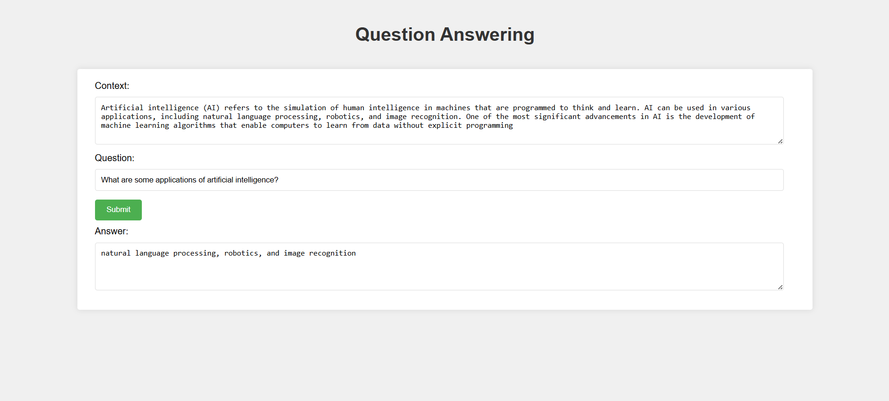

# Question Answering Application

## Overview
This project implements a question-answering application using a pre-trained BERT model. It allows users to input context and questions, and retrieves answers based on the provided context.


## Features
- User-friendly web interface for inputting context and questions.
- Utilizes a BERT-based model for accurate question-answering.
- Built with Flask for the backend and vanilla HTML/CSS/JavaScript for the frontend.

## Technologies Used
- **Frontend**: HTML, CSS, JavaScript
- **Backend**: Flask (Python)
- **Model**: Hugging Face Transformers (BERT for Question Answering)

## File Structure
- app.py              # Flask backend application
- index.html          # Main HTML file for the frontend
- script.js           # JavaScript for handling user interactions
- styles.css          # CSS for styling the application
- trained/            # Directory containing configuration files for the model

## Installation

### Prerequisites
- Python 3.9 or later
- Pip

### Steps to Set Up

1. **Clone the Repository**
   ```bash
   git clone https://github.com/stran1023/Question-Answering-app.git
   cd Question-Answering-app
2. Create a Virtual Environment
   ```bash
   python -m venv venv
3. Activate the Virtual Environment
   ```bash
   venv\Scripts\activate
4. Install Required Packages
   ```bash
   pip install flask flask-cors transformers torch torchvision torchaudio
5. Run the Flask Application
   ```bash
   python app.py
6. Open the Frontend
   - Open a web browser and navigate to http://localhost:8000/index.html (if using a local server) or directly open index.html.

## Installation
1. Enter context in the provided textarea.
2. Input your question in the question field.
3. Click the "Submit" button to retrieve the answer.
